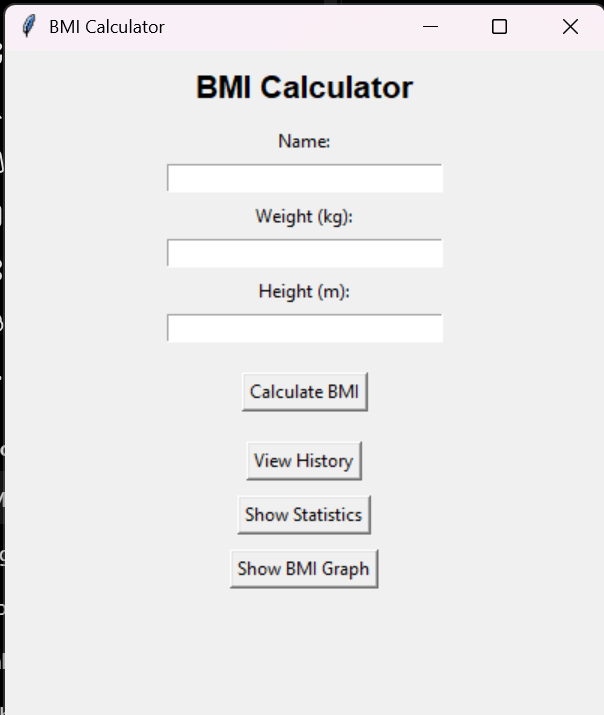
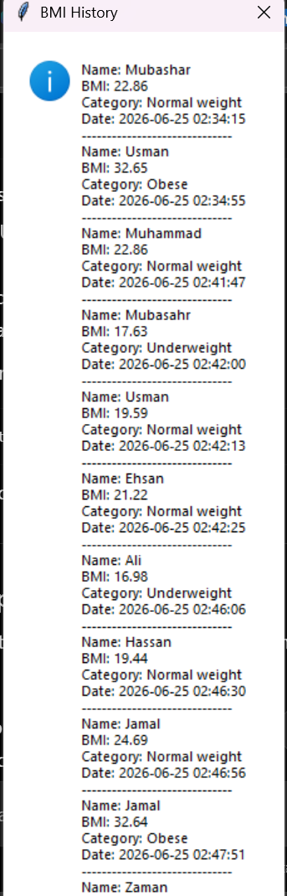
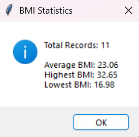
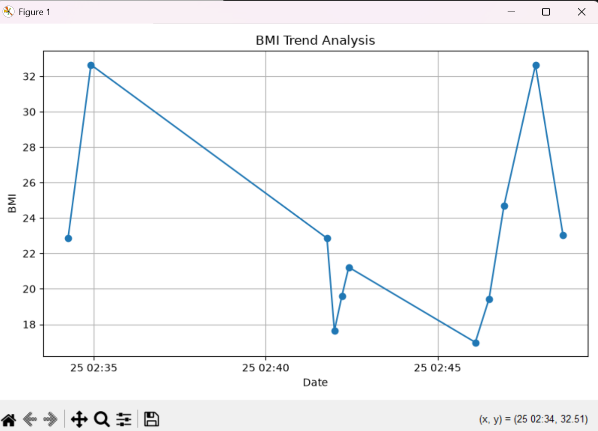

# BMI Calculator

A Python-based BMI (Body Mass Index) Calculator that started as a command-line application and was enhanced into a graphical desktop application using Tkinter.

## Features

### Beginner Features

* Calculate BMI using weight and height
* Categorize BMI into:

  * Underweight
  * Normal Weight
  * Overweight
  * Obese
* Input validation
* Error handling
* Modular code structure using functions

### Advanced Features

* Graphical User Interface (GUI) using Tkinter
* User name input support
* BMI record storage using JSON
* Historical BMI data viewing
* BMI statistics analysis
* BMI trend visualization using Matplotlib
* Multiple user record management
* Timestamp tracking for saved records

## BMI Formula

BMI = Weight (kg) / Height² (m²)

## Technologies Used

* Python 3
* Tkinter
* JSON
* Matplotlib

## Project Structure

```text
BMI-Calculator/
│
├── gui/
│   └── bmi_gui.py
│
├── data/
│   └── bmi_records.json
│
├── screenshots/
│   ├── main_gui.png
│   ├── history_view.png
│   ├── statistics_view.png
│   └── bmi_graph.png
│
├── bmi_calculator.py
├── README.md
├── requirements.txt
└── .gitignore
```

## Installation

1. Clone the repository:

```bash
git clone https://github.com/mub12-ui/BMI-Calculator.git
```

2. Navigate to the project folder:

```bash
cd BMI-Calculator
```

3. Create a virtual environment:

```bash
python -m venv .venv
```

4. Activate the virtual environment:

### Windows

```bash
.venv\Scripts\activate
```

### Git Bash

```bash
source .venv/Scripts/activate
```

5. Install dependencies:

```bash
pip install -r requirements.txt
```

## Running the Application

Run the GUI version:

```bash
python gui/bmi_gui.py
```

## Screenshots

### Main GUI



### History View



### Statistics View



### BMI Trend Graph



## Example Features

* Calculate and classify BMI
* Save BMI records automatically
* View historical BMI records
* Analyze BMI statistics
* Visualize BMI trends through graphs

## Future Improvements

* Export reports to PDF
* User authentication
* Database integration (SQLite)
* Enhanced UI design
* Additional health metrics

## Author

Muhammad Mubashar

## License

This project was developed as part of an internship learning project.
